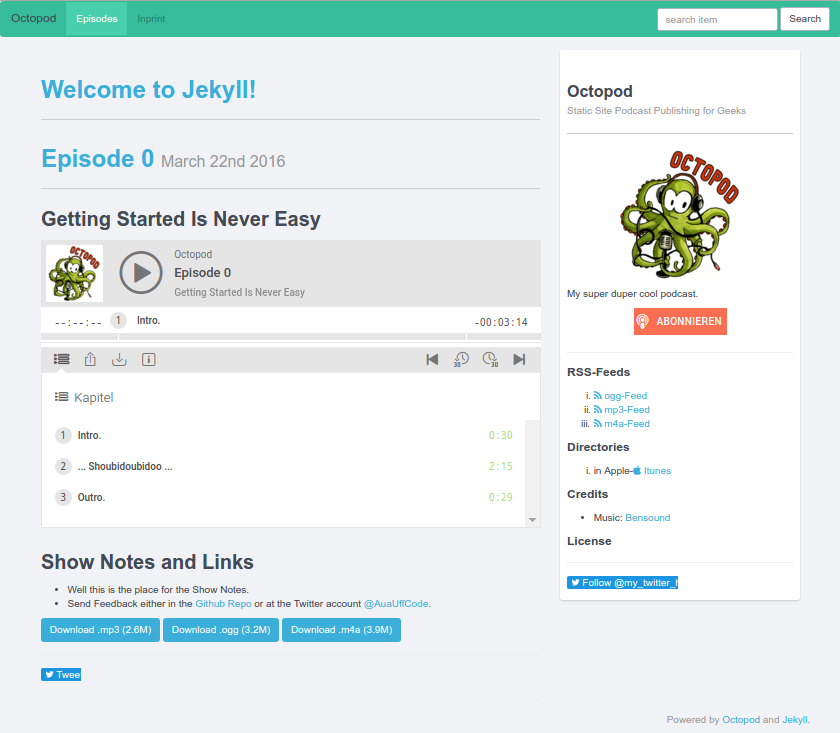

_Podcast Web Feeds with RSS Enclosures and JSON Feed Attachments in the OGG, MP3 or M4A Audio Formats_


# jekyll-octopod library and command line tool - Publish Your Own Radio Talk Shows; Podcast Extension for Building (Static) Websites with Jekyll

github: [jekyll-octopod/jekyll-octopod](https://github.com/jekyll-octopod/jekyll-octopod),
rubygems: [jekyll-octopod](https://rubygems.org/gems/jekyll-octopod),
rdoc: [jekyll-octopod](http://rubydoc.info/gems/jekyll-octopod),
twitter: [jekyll_octopod](https://twitter.com/jekyll_octopod) ++
more: [comments on reddit, please!](https://www.reddit.com/r/ruby/comments/7j1vag/day_11_ruby_advent_calendar_2017_jekyll_octopod/)


Written by [Stefan Haslinger](https://rubygems.org/profiles/informatom)  


Octopod is a podcast publishing extension that lets you build
static websites with podcast (audio) web feeds
(with RSS enclosures and JSON Feed attachments
in the ogg, mp3 or m4a audio formats)
for your radio talk shows with the Jekyll machinery.


## Installation


First, install Bundler and Jekyll, create a new application and cd into it:

```
$ gem install bundler jekyll
$ jekyll new name-of-my-podcast
$ cd name-of-my-podcast
```

If it doesn't exist, create a file `Gemfile` with the contents:

``` ruby
source 'http://rubygems.org'
gem 'jekyll-octopod'
```

If it already exists, add the line

``` ruby
gem 'jekyll-octopod'
```

at the end of.

This way, we tell Jekyll that we want to use Jekyll-Octopod.
Now we install the Jekyll-Octopod and its dependencies and run the setup script via:

```
$ bundle install
$ octopod setup
```

The setup script copies all assets (for example the theme and templates) into
your project. You should be prompted to overwrite a view files that are
generated by `Jekyll`. If you answer the first question with capital `Y`, you
won't be asked again and all files are copied in batch.

Finally, generate the site and test drive it:

```
$ octopod serve
```

## Demo

Open a browser tab and navigate to ```http://localhost:4000```.
You should see the fully functional podcasting site like



Episode 0 is a demo episode with a little bit of audio. You can
listen to the nice tune
[Jazz Comedy](http://www.bensound.com/royalty-free-music/track/jazz-comedy)
from Bensound using the web player.


## Usage

Update the configuration settings in the configuration file `_config.yml` in the application directory.

* You might want to change the images and logos in the `img` directory
* You might want to change the demo episode file and the Jekyll Welcome post in `_posts` and `_episodes`

You can find a documentation of all the non-Octopod-specific settings on the [Configuration page of the Jekyll Documentation](http://jekyllrb.com/docs/configuration/).

Jekyll is highly customizable, if you are into coding (or even just want to get into it), read the [Jekyll Documentation](https://jekyllrb.com/docs/home/). It is very detailed and quite easy to grasp.

First of all, your new podcast episode needs audio data. Octopod assumes that your ready to use audio files stay within the `episodes` directory in your projects root.

```
$ cp ~/my_superduper_audio_files/ocp001.m4a episodes
```
In addition, jekyll-octopod assumes that the different audio files of each of your episodes are the same content in various formats — with the same duration and everything.  
If they are not, you may confuse your listeners - at least when you are using the chapters feature.

Next up, your episode needs some metadata. A title, some kind of a description, maybe chapters and so on. jekyll-octopod keeps all these metadata in one single text file (Protip: these dear little tots feel very lucky when they might live in a version control system!).  
jekyll-octopod kindly helps you to generate these files with the `octopod episode` command. You will get more information on the the command line tool later.

The following command

```
$ octopod episode --title "Why I <3 Octopod"
```

will generate you a template called **YYYY-MM-DD-why-i-_3-octopod.md** (YYYY-MM-DD represents the current date) in your `_posts` subdirectory. When you open it in your text editor you'll see something like this:

``` yaml
---
title: Why I <3 Octopod
subtitle: A Subtle Subtitle
episode-cover: "/img/episode-cover0.jpg' # This can be used to provide episode-specific images
datum: March 22nd 2016 # this is no longer necessary, but in de or en installations, it is still respected
layout: post
author: Uncle Octopod
explicit: 'no'
duration: "0:03:13"
audio:
  m4a: name.m4a
  mp3: name.mp3
  ogg: name.ogg
chapters:
- '00:00:00.000 Intro.'
- '00:00:30.000 Outro.'
posts-dir: "/path/to/post/dir" # default: '_posts'
---
## {{ page.subtitle }}

{{ podigee_player page }}

## Shownotes and Links

* Note
```

The part between the "---" and the "---" is the [YAML front matter](http://jekyllrb.com/docs/frontmatter/).
This is where all the metadata is stored. Below the YAML frontmatter is the area (body) where you can write down your post's content (like the show notes and stuff).
This strange looking `{{ podigee_player page }}` thingy is the [Liquid filter](./liquid-filters),
which represents the iframe where the web player will be included later.

When all this work is done you are ready to take a first look.  
The following command generates your site and starts a local webserver for a preview. You can check your new podcasting website by opening [http://localhost:4000](http://localhost:4000).

```
$ octopod --url "http://localhost:4000" --server
```

Since `localhost:4000` is the default, a shorter command with the same result is:

```
$ octopod s[erve]
```

If everything looks good, you can generate the site with the proper url from your configuration.
*Warning*: Don't upload the `_site` subdirectory after serving it locally, as all links will assume running on `localhost` and this will cause issues!

To build your site use

```
$ octopod b[uild]
```

And deploy it to your server:

```
$ octopod deploy
```

*Warning*: The Rsync settings in your `_config.yml` are mandatory for this last step.
If you don't wish to use rsync, uploading the website from the `_site` subdirectory via FTP or whichever tool you prefer works just fine.


## Appendix: Commands


The octopod-jekyll command line commands are:

```
$ octopod b[uild]
# builds from current path . to ./_site

$ octopod build <path/to/target>                   
# compiles and builds the site from the current path . to path/to/target

$ octopod build <path/to/source> <path/to/target>  
# compiles from source_path to  path/to/target

$ octopod import <importer name> <options>
# imports posts using named import script

$ octopod setup
# Sets up Jekyll site to become podcast-aware, copies assets and default config.
# Asks for confirmation on file overwrite.

$ octopod episode
# adds a post for a new episode

$ octopod deploy
# deploys your site via rsync

$ octopod <command> --help
# for more information on a specific command.

$ octopod s[erver]
# Starts the server
```

Configuration is read from '<source>/_config.yml' but can be overridden.
Available options are documented in `_config.yml`.
In case, you deleted some of the options, a full reference can be found in `_config.yml.sample`.

For ```octopod episode```, the following options are available to override defaults:

```
-a, --author [AUTHOR]

-c, --chapters [CHAPTER1, CHAPTER2...]
# Chapters have the format "HH:MM:SS.sss Title"

-d, --duration [DURATION]
# "HH:MM:SS.sss"

-e, --explicit [yes/no]

--episode-cover [PATH]
# Path to an episode-specific image

-l, --layout [LAYOUT]
# Defaults to 'post', should never need to be changed

-p, --posts_dir [PATH]
# Defaults to '_posts'

-s, --subtitle [TEXT]

--summary [TEXT]

--tags [TAG1, TAG2, ...]

-t, --title [TEXT]
```

All derived Jekyll command line tasks can be found in Jekyll's
[Usage Documentation](http://jekyllrb.com/docs/usage/), from which the octopod
command inherits most of its functionality.

If there is an error when building the site, using the ```-t``` option prints
out the full stack trace, which can be helpful in debugging and improves bug reports.


## Appendix: Real World Examples - Who's Using Octopod?

Live podcast radio talk shows include:

- [Drei Schweinehunde](https://3-schweinehun.de) (in German)
- [Aua-uff-Code!](https://aua-uff-co.de) (in German)
- [Lieblings-Plätzchen](http://www.lieblings-plaetzchen.com) (in German)
- [Swiss-Sided Dice](https://swiss-sided-dice.ch)
- and some more - you! :-)
