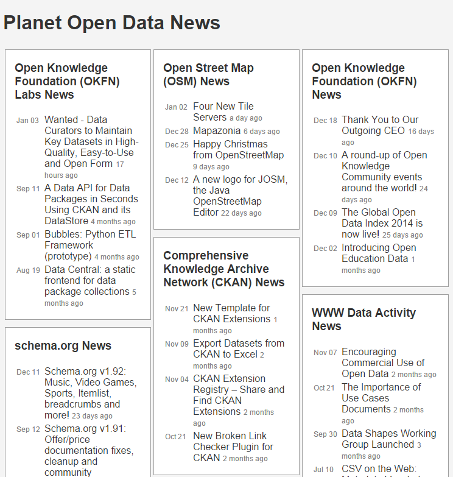
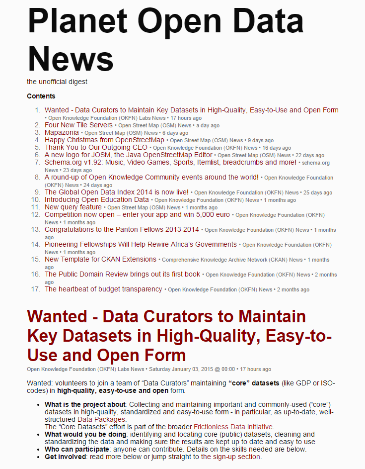

_The Future of Online News - The Future of Facebook & Co - Web Feeds, Web Feeds, Web Feeds_

# pluto library and command line tool - Auto-Build Web Pages From Published Web Feeds; Planet (Static) Website Generator


github: [feedreader/pluto](https://github.com/feedreader/pluto),
rubygems: [pluto](https://rubygems.org/gems/pluto),
rdoc: [pluto](http://rubydoc.info/gems/pluto) ++
more: [comments on reddit, please!](https://www.reddit.com/r/ruby/comments/7j9jaz/day_12_ruby_advent_calendar_2017_autobuild_web/)


## What's Pluto?

A planet (static) website generator
that lets you build web pages from published web feeds.


## Getting Started

### Step 1 - Add all web feeds to your planet configuration

Add all web feeds to add to your planet news site
to your planet configuration file.

Example - `planet.ini`:

```
title = Planet Ruby

[rubylang]
  title = Ruby Lang News
  link  = http://www.ruby-lang.org/en/news
  feed  = http://www.ruby-lang.org/en/feeds/news.rss

[rubyonrails]
  title = Ruby on Rails News
  link  = http://weblog.rubyonrails.org
  feed  = http://weblog.rubyonrails.org/feed/atom.xml

[viennarb]
  title = Vienna.rb News
  link  = http://vienna-rb.at
  feed  = http://vienna-rb.at/atom.xml
```


### Step 2 - Auto-build your planet news site

Use the `pluto` command line tool and pass in the
planet configuration file. Example:

```
$ pluto build planet.ini
```

This will

1) fetch all feeds listed in `planet.ini` and

2) store all entries in a local database, that is, `planet.db` in your working folder and

3) generate a planet web page, that is, `planet.html` using the [`blank` template pack](https://github.com/planet-templates/planet-blank) in your working folder using all feed entries from the local database.

Open up `planet.html` to see your planet web page. Voila!


### Bonus: Try different templates/theme packs

Don't like the look and feel of the built-in standard blank theme / template?
Use a different planet theme or design your own.

See the [Planet Templates](https://github.com/planet-templates) site for more free themes / templates including:

- Blank - default templates; [more »](https://github.com/planet-templates/planet-blank)
- News - 'river of news' style templates; [more »](https://github.com/planet-templates/planet-news)
- Top -  Popurl-style templates; [more »](https://github.com/planet-templates/planet-top)
- Classic -  Planet Planet-Style templates; [more »](https://github.com/planet-templates/planet-classic)


## top - Pluto Planet Template Pack




### Try It Yourself - How To Use the Top Template Pack

If you want to try it yourself, install (fetch) the new template pack. Issue the command:

    $ pluto install top

Or as an alternative clone the template pack using `git`. Issue the commands:

    $ cd ~/.pluto
    $ git clone https://github.com/planet-templates/pluto.top

To check if the new template got installed, use the `list` command:

    $ pluto list

Listing something like:

    Installed templates include:
       top (~/.pluto/top/top.txt)

Showtime! Let's use the `-t/--template` switch to build a sample Planet Ruby. Example:

     $ pluto build planet.ini --template top     or
     $ pluto b -t top            # auto-adds (defaults to) planet.ini

Open up the generated planet page `planet.html` in your browser. Voila. That's it.


## digest - Pluto Planet Template Pack

Design and layout inspired by
[Alterslash - the unofficial Slashdot digest](http://alterslash.org).
Easy to read single page digest.





### Try It Yourself - How To Use the Digest Template Pack

If you want to try it yourself, install (fetch) the new template pack. Issue the command:

    $ pluto install digest

Or as an alternative clone the template pack using `git`. Issue the commands:

    $ cd ~/.pluto
    $ git clone https://github.com/planet-templates/planet-digest

To check if the new template got installed, use the `list` command:

    $ pluto list

Listing something like:

    Installed templates include:
       top (~/.pluto/digest/digest.txt)

Showtime! Let's use the `-t/--template` switch to build a sample Planet Ruby. Example:

     $ pluto build planet.ini --template digest     or
     $ pluto b -t digest         # auto-adds (defaults to) planet.ini

Open up the generated planet page `planet.digest.html` in your browser. Voila. That's it.


## Create Your Own Templates w/ Embedded Ruby (ERB)  - Template Reference


Pluto use "standard / plain vanilla" embedded ruby (ERB) templates.
To create your own templates
use the built-in variables `site`, `feed`, `item`, etc.


### Site

Example: Planet Title

```
<%= site.title %>
```


Example: List all subscriptions

```
<% site.feeds.each do |feed| %>
  <%= feed.url %>  or  <%= feed.link %>
  <%= feed.title %>  or  <%= feed.name %>
  <%= feed.title2 %>
  <%= feed.feed_url %>  or  <%= feed.feed %>
<% end %>
```


### Feed

Example: Lastest feed items

```
<% items = site.items.latest.limit(24)
     ItemCursor.new( items ).each do |item,new_date,new_feed| %>

  <% if new_date %>
    <%= item.published %>
  <% end %>

  <% if new_feed %>
    <%= item.feed.url %>  or  <%= item.feed.link %>
    <%= item.feed.title %>  or  <%= item.feed.name %>
    <%= item.feed.title2 %>
  <% end %>

  <% if item.title %>
    <%= item.title %>
  <% end %>

  <% item.content %>
  <% item.url %>  or  <% item.link %>
  <% item.published %>

<% end %>
```


## Appendix A: Stay Static or Go Dynamic? Pluto Live Starter

Example planet starter site - a Sinatra (dynamic) web app using the pluto machinery.

``` ruby
class Planet < Sinatra::Base

  ##########
  # Models

  include Pluto::Models   # e.g. Feed, Item, Site, etc.

  ############################################
  # Controllers / Routing / Request Handlers

  get '/' do
    erb :index
  end

end
```

(Source: [`planet.rb`](https://github.com/plutolive/pluto.live.starter/blob/master/planet.rb))


Sample template snippet:

``` html
<h1><%= site.title %></h1>

<% site.items.latest.limit(24).each do |item| %>

  <div class='item'>

    <h4 class='feed-title'>
      <%= link_to item.feed.title, item.feed.url %>
    </h4>

    <h2 class='item-title'>
     <%= link_to item.title, item.url %>
    </h2>

    <div class='item-content'>
     <%= item.summary %>
    </div>
  </div>

<% end %>
```

(Source: [`views/index.erb`](https://github.com/plutolive/pluto.live.starter/blob/master/views/index.erb))


## Appendix B: Real World Examples - Who's Using Pluto?

Live planet websites include:

- [OpenStreetMap Blogs](https://blogs.openstreetmap.org), ([Configuration](https://github.com/gravitystorm/blogs.osm.org))
- and some more - you! :-)
