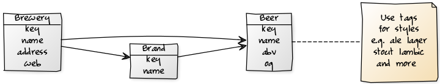

_Cheers, Prost, Kampai, Na zdravi, Salute, 乾杯, Skål, Egészségedre!_


# beerdb library and command line tool - Serve Yourself an Irish Stout, Vienna Lager or Bamberger Rauchbier as JSON; Free Home (Computer) Delivery


github: [beerkit/beer.db](https://github.com/beerkit/beer.db),
rubygems: [beerdb](https://rubygems.org/gems/beerdb),
rdoc: [beerdb](http://rubydoc.info/gems/beerdb)


## What's the beerdb library?

The beerdb library offers a ready-to-use database schema (in SQL)
and models such as - surprise, surprise -
`Beer`, `Brewery`, `Brand`
and friends (using the `ActiveRecord` object-relational mapper machinery). Example:




Let's try the brewery model:

``` ruby
by = Brewery.find_by( key: 'guinness' )

by.title
#=> 'St. James's Gate Brewery / Guinness Brewery'

by.country.key
#=> 'ie'

by.country.title
#=> 'Ireland'

by.city.title
#=> 'Dublin'

by.beers.first
#=> 'Guinness', 4.2

...
```

Or let's try the beer model:


``` ruby
b = Beer.find_by( key: 'guinness' )

b.title
#=> 'Guinness'

b.abv    # that is, alcohol by volume (abv)
#=> 4.2

b.tags
#=> 'irish_dry_stout', 'dry_stout', 'stout'

b.brewery.title
#=> 'St. James's Gate Brewery / Guinness Brewery'
...
```

What's it good for? Good question. Let's build an HTTP JSON service
that serves up a Guinness Irish Stout
or a Bamberg Aecht Schlenkerla Rauchbier Märzen as JSON?
Example - `GET /beer/guinness`:

``` json
{
  "key": "guinness",
  "title": "Guinness",
  "synonyms": "Guinness Draught",
  "abv": "4.2",
  "srm": null,
  "og": null,
  "tags": ["irish_dry_stout","dry_stout","stout"],
  "brewery":
  {
    "key": "guinness",
    "title": "St. James's Gate Brewery / Guinness Brewery"
  },
  "country":
  {
    "key": "ie",
    "title": "Irland"
  }
}
```

Let's use the Sinatra-like webservice library that offers a mini language,
that is, domain-specific language (DSL)
that lets you define routes, that is, HTTP methods paired with an URL-matching pattern
and much more.
For example, you can code the `GET /beer/guinness` route in
the webservice library as `get '/beer/guinness'`.
To make it into a route for any beer lets replace the `guinness` beer key
with a placeholder, thus, resulting in `get '/beer/:key'`. Let's run it:

`service.rb`:

``` ruby

class BeerService < Webservice::Base

  include BeerDb::Models     # lets (re)use the Beer, Brewery, etc. models

  get '/beer/:key' do
    Beer.find_by!( key: params[:key] )
  end

end
```

That's it. Ready to serve. Let's boot-up the beer service
with a web server (e.g. Thin) using a Rack handler. Example:

`boot.rb`:

``` ruby
require 'webservice'      # note: webservice will pull in web server machinery (e.g. rack, thin, etc.)
require 'beerdb/models'   # note: beerdb will pull in database access machinery (e.g. activerecord, etc.)

# database setup 'n' config
ActiveRecord::Base.establish_connection( adapter:  'sqlite3', database: './beer.db' )


require './service'

Rack::Handler::Thin.run BeerService, :Port => 9292
```

Try:

```
$ ruby ./boot.rb
```

Open up your browser and try `http://localhost:9292/beer/guinness`.
Voila. Enjoy your Guinness irish stout responsibly.


## Bonus:  Let's add brewery details and more

Let's add brewery details to the beer service and lets add a new `GET /brewery` route. Example:

``` ruby
get '/beer/:key' do
  beer = Beer.find_by!( key: params[ :key ] )

  brewery = {}
  if beer.brewery.present?
     brewery = { key:   beer.brewery.key,
                 title: beer.brewery.title }
  end

  tags = []
  if beer.tags.present?
     beer.tags.each { |tag| tags << tag.key }
  end

  { key:      beer.key,
    title:    beer.title,
    synonyms: beer.synonyms,
    abv:      beer.abv,
    srm:      beer.srm,
    og:       beer.og,
    tags:     tags,
    brewery:  brewery,
    country:  { key:   beer.country.key,
                title: beer.country.title }
  }
end


get '/brewery/:key' do

  brewery = Brewery.find_by!( key: params[:key] )

  beers = []
  brewery.beers.each do |b|
    beers << { key: b.key, title: b.title }
  end

  tags = []
  if brewery.tags.present?
     brewery.tags.each { |tag| tags << tag.key }
  end

  { key:      brewery.key,
    title:    brewery.title,
    synonyms: brewery.synonyms,
    since:    brewery.since,
    address:  brewery.address,
    web:      brewery.web,
    tags:     tags,
    beers:    beers,
    country:  { key:   brewery.country.key,
                title: brewery.country.title }
  }
end
```
