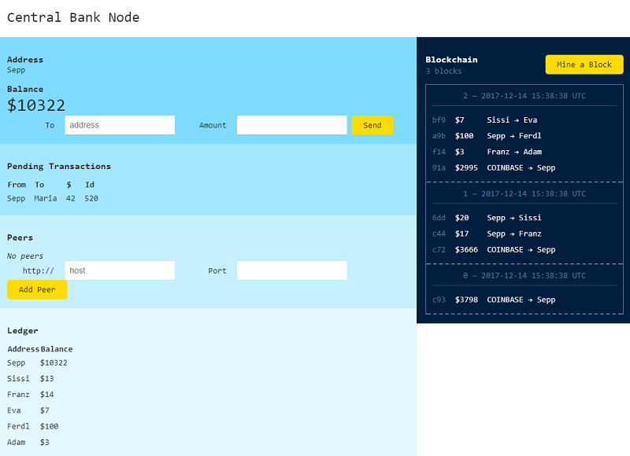

Cryptos, Cryptos, Cryptos -
Revolutionize the world with blockchains, blockchains, blockchains one block at a time!

# centralbank library and command line tool - Print Your Own Money / Cryptocurrency; Run Your Own Federated Central Bank Nodes on the Blockchain Peer-to-Peer over HTTP

github: [openblockchains/centralbank](https://github.com/openblockchains/centralbank),
rubygems: [centralbank](https://rubygems.org/gems/centralbank),
rdoc: [centralbank](http://rubydoc.info/gems/centralbank)


Use the `centralbank` command line tool. Try:

```
$ centralbank -h     
```

resulting in:

```
Usage: centralbank [options]

  Wallet options:
    -n, --name=NAME                  Address name (default: Alice)

  Server (node) options:
    -o, --host HOST                  listen on HOST (default: 0.0.0.0)
    -p, --port PORT                  use PORT (default: 4567)
    -h, --help                       Prints this help
```

To start a new (network) node using the default wallet
address (that is, Alice) and the default server host and port settings
use:

```
$ centralbank
```

Stand back ten feets :-) while starting up the machinery.
Ready to print (mine) money on the blockchain?
In your browser open up the page e.g. `http://localhost:4567`. Voila!




Note: You can start a second node on your computer -
make sure to use a different port (use the `-p/--port` option)
and (recommended)
a different wallet address (use the `-n/--name` option).
Example:

```
$ centralbank -p 5678 -n Bob
```

Happy mining!


## Inside Mining - Printing Cryptos, Cryptos, Cryptos on the Blockchain


What happens when you hit the "Mine a block" button? Let follow the code.

The form gets posted by the browser and hits the /mine route in centralbank
network service

``` ruby
class Service < Sinatra::Base
  # ...
  post '/mine' do
    node.on_mine!
    redirect '/'
  end
  # ...
end
```

(Source: [lib/centralbank/service.rb](https://github.com/openblockchains/centralbank/blob/master/lib/centralbank/service.rb))

So the code mines a block and refreshes the page. That's it!
Let's dive into the `on_mine!` method in the network node:

``` ruby
class Node
  # ...
  def on_mine!
    @bank.mine_block!
    send_chain_to_peers
  end  
  # ...
end
```

(Source: [lib/centralbank/node.rb](https://github.com/openblockchains/centralbank/blob/master/lib/centralbank/node.rb))


So the code mines a block and sends the new blockchain (chain) to
all peers (nodes). That's it!
Let's dive into the `mine_block!` method for the centralbank machinery:

``` ruby
class Bank
  # ...
  def mine_block!
    @pending << Tx.new( Centralbank.config.coinbase,
                        @address,
                        Centralbank.config.mining_reward )

    ## add mined (w/ computed/calculated hash) block
    @chain << @pending.transactions
    @pending = Pool.new   ## clear out/ empty pool (just create a new one for now)

    ## update ledger (balances) with new confirmed transactions
    @ledger = Ledger.new( @chain )
  end
  # ...
end
```

(Source: [lib/centralbank/bank.rb](https://github.com/openblockchains/centralbank/blob/master/lib/centralbank/bank.rb))

So the code adds a "COINBASE" transaction (tx) to the pending pool
(of unconfirmed transactions).
For mining a new block you will get a
mining reward (e.g. $5). That's the magic moment of printing new money
on the blockchain.  
Next all pending (unconfirmed but validated) transactions
get added to the blockchain (chain) as a new block.
Done! Block mined! Let's clear out the pending pool
and update all wallet balances, that is, update the ledger book.
Let's dive into the `<<` method for the blockchain (chain) machinery:


``` ruby
class Blockchain
  # ...
  def <<( txs )
    if @chain.size == 0
      block = Block.first( txs )
    else
      block = Block.next( @chain.last, txs )
    end
    @chain << block
  end
  # ...
end
```

(Source: [lib/centralbank/blockchain.rb](https://github.com/openblockchains/centralbank/blob/master/lib/centralbank/blockchain.rb))

So the code adds a block to the chain at the end and passes along
the hash of the last block on the blockchain to the new block. That's all the magic
of printing money.

What about proof-of-work and the hashing power/rate?
See the [blockchain-lite library - Build Your Own Blockchains with Crypto Hashes](01-blockchain-lite.md)
article in the series.

Happy mining!


## Bonus: Local Development Setup

For local development - clone or download (and unzip) the centralbank code repo.
Next install all dependencies using bundler with a Gemfile e.g.:

``` ruby
# Gemfile

source "https://rubygems.org"

gem 'sinatra'
gem 'sass'
gem 'blockchain-lite'
```

run

```
$ bundle       ## will use the Gemfile (see above)
```

and now you're ready to run your own centralbank server node. Use the [`config.ru`](https://github.com/openblockchains/centralbank/blob/master/config.ru) script for rack:

``` ruby
# config.ru

$LOAD_PATH << './lib'

require 'centralbank'

run Centralbank::Service
```

and startup the money printing machine using rackup - the rack command line tool:

```
$ rackup       ## will use the config.ru - rackup configuration script (see above).
```

In your browser open up the page e.g. `http://localhost:9292`. Voila! Happy mining!
